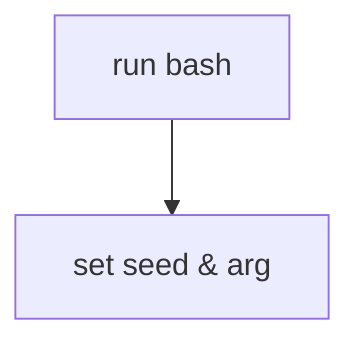
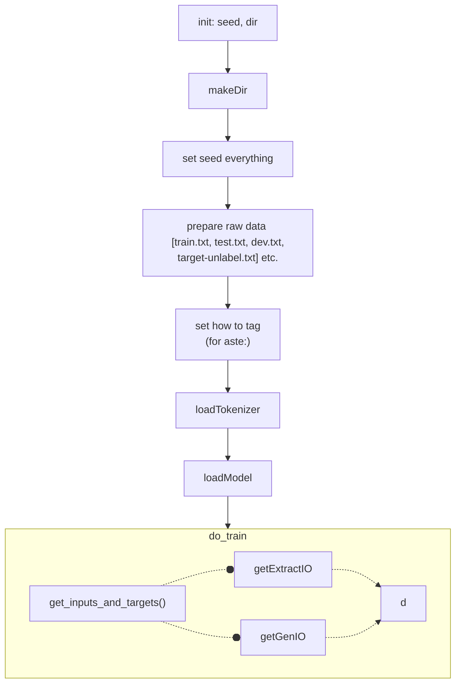

# shell script

```mermaid
graph TD;

start["run bash"];
setSeed["set seed & arg"];

start--> setSeed


```

# `def main()` at main.py  


```mermaid
graph TD;
    init["init: seed, dir"]
    makeDir
    setSeed["set seed everything"]
    prepareRaw["prepare raw data <br> [train.txt, test.txt, dev.txt, target-unlabel.txt] etc."]
    prepareTag["set how to tag<br> (for aste:)"]

    init--> makeDir --> setSeed --> prepareRaw
    prepareRaw --> prepareTag --> loadTokenizer --> loadModel --> do_train

    subgraph do_train
    getDataset["get_inputs_and_targets()"] 
    getDataset -.-o getExtractIO & getGenIO -.-> d
    
    end

```

## ASTE TOKEN

```python
tag_tokens += [i[0] for i in TAG_TO_SPECIAL.values()]
tag_tokens += [OPINION_TOKEN, SEP_TOKEN]
```


