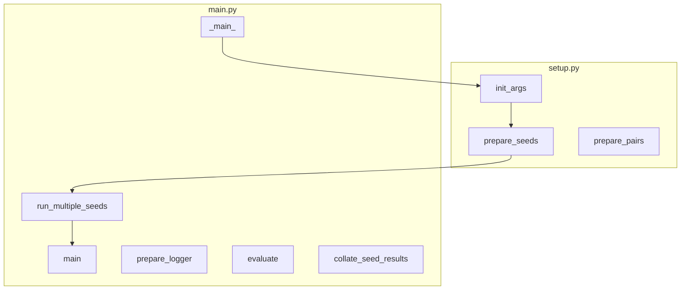

<!-- 
```
	subgraph constants.py

	end

	subgraph data_utils.py
		filter_invalid
		filter_none
		normalize_augment
		real_line_examples_from_file

		class_ABSADataset["more_detail"]

		get_inputs
		prepare_aste_extraction
		prepare_aste_universal
		prepair_aste_gene
		get_generateion_inputs_and_targets
		get_extraction_inputs_and_targets
		get_inputs_and_targets
		save_inputs_and_targets
		get_dataset 
	end

	subgraph preprocess.py
		ot2bieos_absa
		bieos2generation
		read_by_bieos
		write_generation
		preprocess
		prepare_raw_data
	end

	subgraph model_utils.py
		prepare_constrained_tokens
		prepare_tag_tokens
		init_tag
	end

	subgraph eval_utils.py
		extract_spans_extraction
		extract_aste_from_extraction_universal
		extract_aste_from_extraction
		recover_terms_with_editdistance
		fix_preds_aste
		fix_red_with_editdistance
		compute_f1_scores
		compute_scores
		avg_n_seeds_by_pair
	end

	subgraph run_utils.py
		class_Prefix_fn_cls
		train
		aux_training
		infer
		data_gene
		pseudo_label
		pseudo_filter_none
		extract_model
		gene_model
		postprocess_gene_outputs
		extract_label_words
		prepare_gene_vocab
		model_filter
		
	end 


	

``` -->