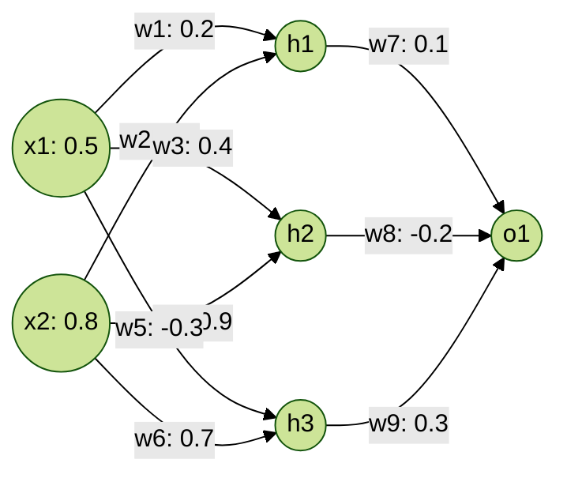

```bash
!python main.py --help
```

```bash

usage: main.py [-h] --task TASK [--device DEVICE] --dataset DATASET [--data_dir DATA_DIR]
               [--model_name_or_path MODEL_NAME_OR_PATH] --paradigm PARADIGM [--do_train]
               [--do_eval] [--name NAME] [--commit COMMIT] [--save_last_k SAVE_LAST_K]
               [--n_runs N_RUNS] [--clear_model] [--save_best] [--nrows NROWS] [--train_by_pair]
               [--target_domain TARGET_DOMAIN] [--no_greedy] [--beam BEAM]
               [--max_seq_length MAX_SEQ_LENGTH] [--n_gpu N_GPU]
               [--train_batch_size TRAIN_BATCH_SIZE] [--eval_batch_size EVAL_BATCH_SIZE]
               [--gradient_accumulation_steps GRADIENT_ACCUMULATION_STEPS]
               [--learning_rate LEARNING_RATE] [--num_train_epochs NUM_TRAIN_EPOCHS] [--seed SEED]
               [--weight_decay WEIGHT_DECAY] [--adam_epsilon ADAM_EPSILON]
               [--warmup_steps WARMUP_STEPS] [--init_tag INIT_TAG] [--data_gene]
               [--data_gene_epochs DATA_GENE_EPOCHS] [--data_gene_extract]
               [--data_gene_extract_epochs DATA_GENE_EXTRACT_EPOCHS]
               [--data_gene_none_remove_ratio DATA_GENE_NONE_REMOVE_RATIO]
               [--data_gene_none_word_num DATA_GENE_NONE_WORD_NUM]
               [--data_gene_extract_none_remove_ratio DATA_GENE_EXTRACT_NONE_REMOVE_RATIO]
               [--data_gene_same_model] [--data_gene_wt_constrained] [--use_same_model]
               [--model_filter] [--model_filter_skip_none] [--data_gene_decode DATA_GENE_DECODE]
               [--data_gene_top_p DATA_GENE_TOP_P] [--data_gene_num_beam DATA_GENE_NUM_BEAM]
               [--data_gene_min_length DATA_GENE_MIN_LENGTH] [--extract_model EXTRACT_MODEL]
               [--gene_model GENE_MODEL] [--runned_folder RUNNED_FOLDER]
               [--data_gene_aug_num DATA_GENE_AUG_NUM] [--data_gene_aug_ratio DATA_GENE_AUG_RATIO]
               [--pseudo] [--pseudo_skip_none]

optional arguments:
  -h, --help            show this help message and exit
  --task TASK           The name of the task, selected from: [xabsa]
  --device DEVICE
  --dataset DATASET     The name of the dataset, selected from: [cross_domain]
  --data_dir DATA_DIR   args.output_dir/data
  --model_name_or_path MODEL_NAME_OR_PATH
                        Path to pre-trained model or shortcut name
  --paradigm PARADIGM   The way to construct target sentence, selected from:[ extraction: (apple,
                        positive); (banana, negative) // None extraction-universal: <pos> apple
                        <pos> orange <neg> banana // [none] ]
  --do_train            Whether to run training.
  --do_eval             Whether to run eval on the dev/test set.
  --name NAME           name of the exp
  --commit COMMIT       commit id
  --save_last_k SAVE_LAST_K
                        save last k
  --n_runs N_RUNS       run with n seeds
  --clear_model         remove saved ckpts
  --save_best           save best model only
  --nrows NROWS         # of lines to be read
  --train_by_pair       train a model for each pair
  --target_domain TARGET_DOMAIN
  --no_greedy           only constrained decoding
  --beam BEAM
  --max_seq_length MAX_SEQ_LENGTH
  --n_gpu N_GPU
  --train_batch_size TRAIN_BATCH_SIZE
                        Batch size per GPU/CPU for training.
  --eval_batch_size EVAL_BATCH_SIZE
                        Batch size per GPU/CPU for evaluation.
  --gradient_accumulation_steps GRADIENT_ACCUMULATION_STEPS
                        Number of updates steps to accumulate before performing a backward/update
                        pass.
  --learning_rate LEARNING_RATE
  --num_train_epochs NUM_TRAIN_EPOCHS
                        Total number of training epochs to perform.
  --seed SEED           random seed for initialization
  --weight_decay WEIGHT_DECAY
  --adam_epsilon ADAM_EPSILON
  --warmup_steps WARMUP_STEPS
  --init_tag INIT_TAG   [english]
  --data_gene           enable data generation
  --data_gene_epochs DATA_GENE_EPOCHS
                        epoch of generation model training
  --data_gene_extract   enable text-to-label stage
  --data_gene_extract_epochs DATA_GENE_EXTRACT_EPOCHS
                        epoch of extract model training
  --data_gene_none_remove_ratio DATA_GENE_NONE_REMOVE_RATIO
                        remove none input for gene model
  --data_gene_none_word_num DATA_GENE_NONE_WORD_NUM
                        rand word added to generate diverse none examples
  --data_gene_extract_none_remove_ratio DATA_GENE_EXTRACT_NONE_REMOVE_RATIO
                        remove none training sample for extract model training
  --data_gene_same_model
                        extract & gene model share the same model
  --data_gene_wt_constrained
                        turn off constrained decoding during gene generation
  --use_same_model      all stages use the same model
  --model_filter        use extract model inference for filtering
  --model_filter_skip_none
                        keep the sample if extract model output none
  --data_gene_decode DATA_GENE_DECODE
                        [greedy, top_p, beam]
  --data_gene_top_p DATA_GENE_TOP_P
  --data_gene_num_beam DATA_GENE_NUM_BEAM
  --data_gene_min_length DATA_GENE_MIN_LENGTH
  --extract_model EXTRACT_MODEL
                        path to extract model
  --gene_model GENE_MODEL
                        path to gene model
  --runned_folder RUNNED_FOLDER
                        Load previous trained model for aux training
  --data_gene_aug_num DATA_GENE_AUG_NUM
                        how many augmentation samples
  --data_gene_aug_ratio DATA_GENE_AUG_RATIO
                        how much ratio of augmentation samples
  --pseudo              data generation
  --pseudo_skip_none    use non-none only

```


