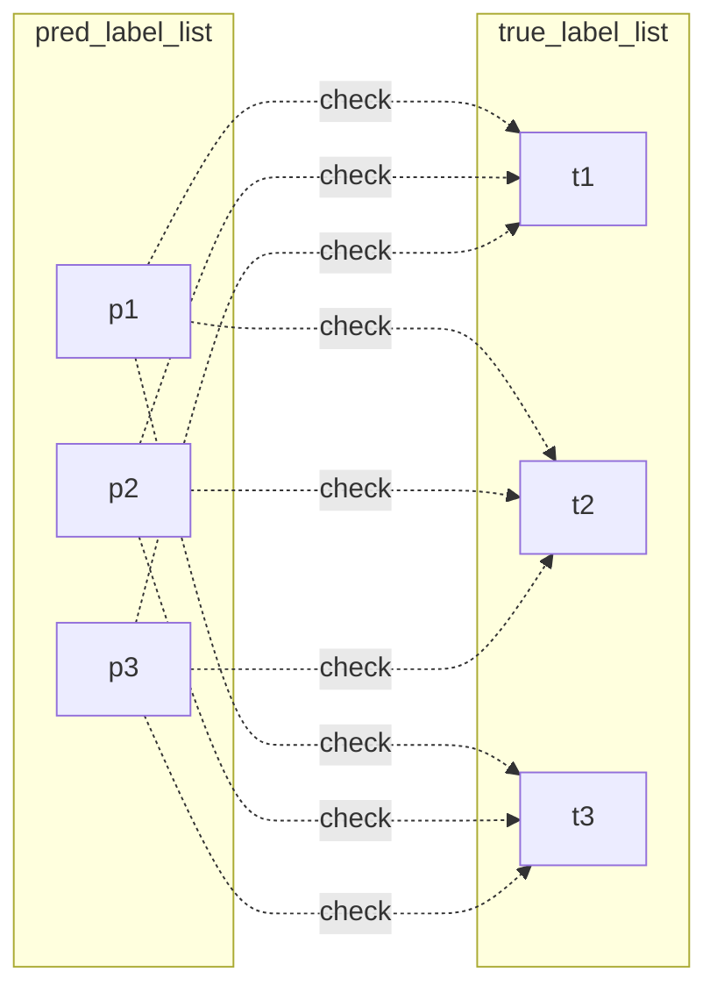

# Criteria
```python
# (pred_text-to-label) เทียบกัน (data_processed_trans_th.txt)
if sentiment ถูก:
	if len(aspect) == 1:
		check aspect_word(forsome(pred, true)) > theshold && check opinion(forsome(pred, true)):		
				is_correct = True
	if len(aspect) true > pred:
			เอา pred ดูว่าตรงกับอันไหน
			if เจอ :
				is_correct= True
	if len(aspect) true < pred:

else:
	is_correct = False

```


- `sentiment` ถูกมั้ย ?
	- `aspect` ครบมั้ย ?
		- `aspect_word` & `opinion_word` ตรงกับเฉลยมั้ย ?
	- `aspect` ไม่ครบ ต้องตรงกันมากกว่า 80% ?


## pseudocode

```python

def check(x, y):
    x_s, x_a, x_o = x   # true label
    y_s, y_a, y_o = y   # pred label

    return x_s == y_s, \
        get_similar_word(x_a, y_a) > THESHOLD_ASPECT, \
            get_similar_word(x_b, y_b) >THESHOLD_OPINION


```